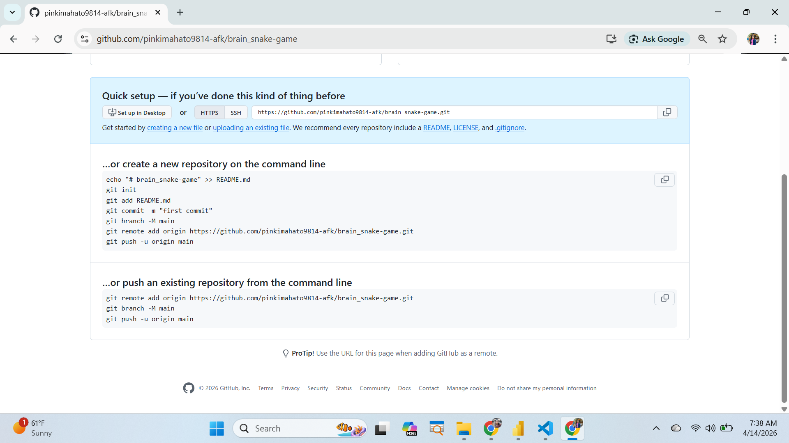

THIS IS GITHUB DETAILS

…or create a new repository on the command line

echo "# brain_snake-game" >> README.md
git init
git add README.md
git commit -m "first commit"
git branch -M main
git remote add origin https://github.com/pinkimahato9814-afk/brain_snake-game.git
git push -u origin main

…or push an existing repository from the command line
git remote add origin https://github.com/pinkimahato9814-afk/brain_snake-game.git
git branch -M main
git push -u origin main

